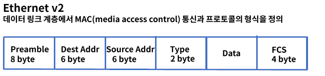
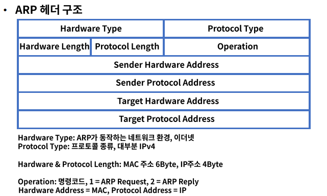
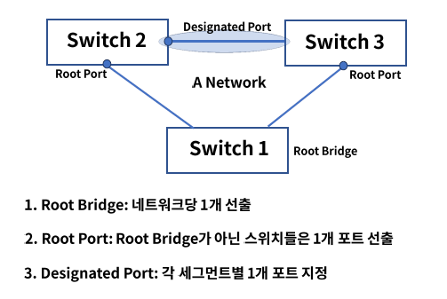
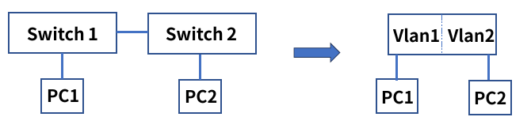
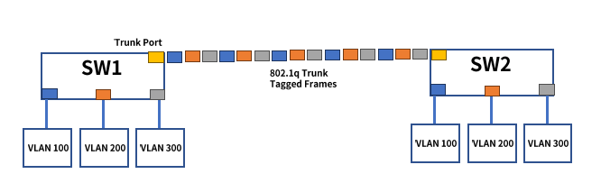

# 3. Data Link

### 역할

- 물리계층에서 발생할 수 있는 오류를 감지하고 수정

- 대표적인 프로토콜로 이더넷이 있으며 장비로는 스위치가 있다.

### 계층

2개의 부 계층으로 구성

- MAC(Media Access Control)

  물리적인 부분으로 매체간의 연결방식을 제어하고 1 계층과 연결

- LLC(Logical Link Control)

  논리적인 부분으로 Frame을 만들고 3계층과 연결

### 주요 기능

#### Framing

데이터 그램을 캡슐화하여 프레임 단위로 만들고 헤더와 트레일러를 추가

헤더는 목적지, 출발지 주소 그리고 데이터 내용을 정의

트레일러는 비트 에러를 감지

#### 회선제어

신호간의 충돌이 발생하지 않도록 제어

- ENQ/ACK 방법 - 전용 전송 링크 1:1

- Polling 방법 - 1:다

  Select 모드: 송신자가 나머지 수신자들을 선택하여 전송

  Poll 모드: 수신자에게 데이터 수신 여부를 확인하여 응답을 확인하고 전송 - multipoint

- Stop & Wait
- Sliding Window

#### 오류 제어

- ARQ(Automatic Repeat Request): 프레임 손상 시 재전송이 수행되는 과정

### 이더넷 프레임 구조

Preamble: 이더넷 프레임의 시작과 동기화

Dest Addr: 목적지 MAC주소,  Src Addr: 출발지 MAC 주소

Type: 캡슐 화되어 있는 패킷의 프로토콜 정의

Data: 상위 계층의 데이터

FCS(Frame Check Sequence): 에러 체크

## 스위치

허브의 단점을 보완

Half duplex -> Full duplex

1 Collision Domai -> 포트별 Collision Domain

라우팅 기능이 있는 스위치 L3 스위치

#### 동작 방식

1. Learning : 출발지 주소가 MAC 주소 테이블에 없으면 해당 주소를 저장
2. Flooding - Broadcasting : 목적지 주소가 MAC 주소 테이블에 없으면 전체 포트로 전달
3. Forwarding : 목적지 주소가 MAC 주소 테이블에 있으면 해당 포트로 전달
4. Filtering - Collision Domain : 출발지와 목적지가 같은 네트워크 영억이면 다른 네트워크로 전달하지 않음
5. Aging : MAC 주소 테이블의 각 주소는 일정 시간 이후에 삭제

### ARP

Address Resolution Protocol

IP 주소를 통해서 MAC 주소를 알려주는 프로토콜

### Looping

- 같은 네트워크 대역 대에서 스위치에 연결된 경로가 2개 이상인 경우에 발생
- PC가 브로드캐스팅 패킹을 스위치들에게 전달하고 전달 받은 스위치들은 Flooding을 한다
- 스위치들끼리 Flooding된 프레임이 서로 계속 전달되어 네트워크에 문제를 일으킨다.

#### STP(Spanning Tree Protocal)

자동으로 루핑을 막아주는 알고리즘 : Spanning Tree

Spanning Tree에 사용되는 프로토콜 -> STP

STP의 두가지 개념

1. Bridge ID - 스위치의 우선순위, 낮을수록 우선순위가 높다

2. Path Cost - 링크의 속도(대역폭), 1000/링크 속도

   작을수록 우선 순위가 높다. 

#### BPDU(Bridge Protocol Data Unit)

스패팅 트리 프로토콜에 의해 스위치간 서로 주고받는 제어 프레임

- Configuration BPDU: 구성관련

1. Root BID - 루트 브리지로 선출될 스위치 정보
2. Path Cost - 루트 브리지까지의 경로 비용
3. Bridge ID, Port ID - 나머지 스위치와 포트의 우선순위

- TCN BPDU: 네트워크 내 구성 변경시 통보

#### 과정

Root Bridge 선출 : 서로 BPDU를 교환하고 가장 낮은 숫자가 루트 브리지

Root Port 선출: 나머지 스위치들은 루트 브리지와 가장 빠르게 연결되는 루트 포트를 선출

Designated Port 선출: 각 세그먼트별 루트 브리지와 가장 빠르게 연결되는 포트를 Designated 포트로 선출

#### 상태 변화

1. Disabled : 포트가 Shut Down인 상태로 데이터 전송 불가, MAC 학습 불가, BPDU 송수신 불가
2. Blocking : 부팅하거나 Disabled인 상태를 Up했을 때 첫번째 거치는 단계, BPDU만 송수신
3. Listening(15초) : Blocking 포트가 Root 또는 Designated 포트로 선정되는 단계, BPDU만 송수신
4. Learning(15초) : 리스닝 상태에서 특정 시간이 흐른 후 러닝 상태가 됨, MAC 학습 시작
5. Forwarding : 러닝 상태에서 특정 시간이 흐른 후 포워딩 상태가 됨, 데이터 전송 시작

#### RSTP & MST

- RSTP(Rapid Spanning Tree Protocol)

  Learning & Listening 단계를 없애고 시간을 빠르게 함

- MST(Multiple Spanning Tree)

  네트워크 그룹이 많아지면 프레임이 많아지고 스위치 부하 발생 -> 여러개의 STP 그룹들을 묶에서 효율적으로 관리

  

## VLAN

물리적 구성이 아닌 논리적인 가상의 LAN을 구성하는 기술

불필요한 데이터 차단 : 브로드 캐스트 도메인 별로 나누어 관리

관리의 용이성과 보안 : 호스트의 물리적 이동 없이 LAN 그룹 변경이 가능

비용 절감 : 새로운 LAN 추가시 물리적 스위치 구매 필요 없음

#### 종류

1. Port 기반 VLAN

   - 여러개의 VLAN을 설정하고 각각의 LAN에 물리적인 포트를 지정

   - VLAN 변경이 필요한 호스트는 물리적인 포트 또는 스위치의 VLAN 설정을 변경

2. MAC주소 기반 VLAN

   - 각 호스트 또는 네트워크 장비의 MAC주소를 각각의 VALN에 정의

   - 호스트가 이동되어도 VLAN 변경 필요없음, 신규 호스트 연결시 설정 변경 필요

3. IP주소 기반 VLAN

   - IP주소 서브넷 기반으로 VLAN을 나누는 방법

### Trunk

물리적 스위치간 VLAN 연결 시 하나의 물리적 연결로 VLAN 그룹들 공유

트렁크 프로토콜 : 이더넷 프레임에 식별용 VLAN ID를 삽입하여 데이터를 구분하여 통신 및 제어 가능

### 참조

fastcampus