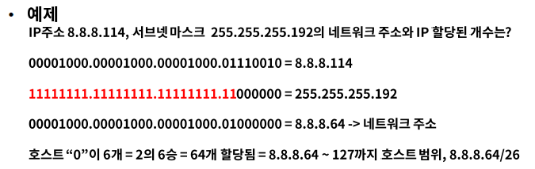
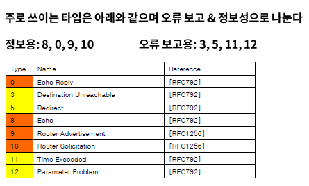
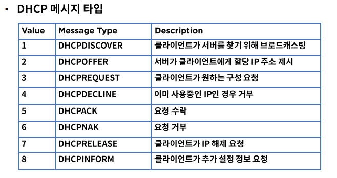
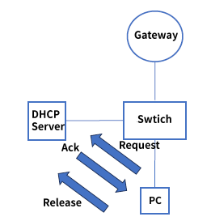

# 4. Network

### 역할

- IP(Internet Protocol)주소를 사용하여 통신, 계층적 구조
- 대표적인 장비는 라우터(L3)

## IP

네트워크 계층에서 통신하는 주요 프로토콜로 라우팅을 구현하고 본질적인 인터넷을 구축하는 계기

#### IP 구조

헤더(목적지 & 출발지)와 페이로드(데이터)로 구성

#### 네트워크와 호스트

네트워크는 브로드캐스트 영역, 호스트는 개별 단말기

ex) 192.168.1 : 네트워크(라우터), 192.168.1.0~255 : 호스트(PC)

## 라우터

목적지 IP주소를 확인하고 하나 또는 그 이상의 네트워크 간의 패킷의 경로를 선택하여 전송

Router : 네트워크 간의 패킷을 전송해주는 장비

Routing : 네트워크 간의 패킷을 전달하는 경로를 선택하는 과정, Static & Dynamic

Routed : 라우터가 라우팅을 해주는 대상, IP

### 서브넷 마스크

#### 개념

- 서브넷 : 부분망, IP주소는 네트워크와 호스트로 구분
- 할당된 네트워크 영역을 좀 더 효율적으로 사용하기 위해 서브넷으로 쪼개어 구성
- 네트워클르 여러개의 작은 네크워크 서브넷으로 구분하는 것 -> 서브넷 마스크

> 네트워크 별 첫번째 숫자와 마지막 숫자는 Reserved로 사용하지 않음
>
> 첫번째 숫자 : 네트워크 영역을 알림, 마지막 숫자 : 브로드 캐스트 주소, 게이트 웨이(라우터)

#### 상세

디폴트 게이트웨이 : 다른 네트워크로 패킷 전송시 거쳐야 하는 거점

Prefix 표기법 : 서브넷 마스크 표기를 간단히 표현, 네트워크 영역의 비트 "1"의 갯수를 의미

### 라우터의 동작 방식

- **Static 라우팅**

  가장 기본적인 라우팅 방식으로 수동으로 경로를 라우터에 설정하여 패킷을 처리

  경로는 라우팅 테이블에 목적지 IP 주소 & 인터페이스 정보를 설정

  예시 참고하기!

- Hop & TTL

  전세계 네트워크 호스트는 IP 라우팅을 통해서 연결

  Hop: 소스와 목적지 간의 경로

  TTL(Time to Live): 패킷이 폐기되기 전 hop 카운트 => 부정확한 패킷의 루프를 방지하기 위함

### ICMP

- ICMP(Internet Control Message Protocol)

- IP 통신은 목적지에 패킷을 정상적을 전달하는 방법은 있지만 에러 발생시 처리 불가

- ICMP는 IP 통신의 에러 상황을 출발지에 전달 & 메시지 제어 역할

- IP 패킷에 포함되어 있음

#### ICMP Type

- Type 8 & 0

  Echo Request & Reply

  - 네트워크 문제 진단시 사용
  - 출발지에서 목적지 IP로 Echo Request를 보내면 목적지는 Echo Reply로 응답
  - 목적지 도달 여부, RTT(Round-Trip delay Time), hop count 확인

- Type 9 & 10

  라우터 광고 & 정보 요청

  - 자신이 라우터 임을 응답 & 네트워크 진입시 라우터 정보 요청

- Type 3 

  Destination Unreachable

  - 0 = net unreachable
  - 1 = host unreachable
  - 2 = protocol unreachable
  - 3 = port unreachable
  - 4 = fragmentation needed and DF set
  - 5 = source route failed

- Type 5

  Redirect

  - 로컬 네트워크에 2개 이상의 경로가 존재하는 경우 더 좋은 경로를 알려주는 역할

- Type 11

  Time Exceeded

  - 시간초과, TTL 값이 "0"이 되면 출발지에 응답
  - 0 = Time to Live Exceeded : 그냥 시간 초과
  - 1 = Fragment Reassembly Time Exceeded : 부분적으로만 도착한 후 시간 초과

  > IP Fragmentation : IP 패킷을 작은 패킷으로 나누어 전송하고 목적지에서 재조합
  >
  > MTU(Maximum Transmission Unit): IP 패킷을 전송할 수 있는 최대크기
  >
  > MTU 보다 IP 패킷이 크다면 IP Fragmentation을 이용

- Type 12

  Paremeter Problem

  - IP 옵션을 잘못 사용하여 라우터에 패킷 폐기

### DHCP

#### 정의

- 동적 호스트 구성 프로토콜

- DHCP 서버를 사용하여 클라이언트인 네트워크 장치에 IP 주소를 자동으로 할당

- > 요청에 의한 IP 할당으로 효율성 극대화
  >
  > 잘못된 IP 설정으로 인한 장애 예방
  >
  > IP 변경이 잦은 호스트의 관리

#### DHCP 동작 과정

> 기본 네트워크 구성, Gateway - Switch - DHCP Server - PC

1. IP 할당

   - DHCPDISCOVER : PC가 DHCP server 발견
   - DHCPOFFER : DHCP server는 PC에게 IP 제안
   - DHCPREQUEST : PC는 제안 받은 IP 할당을 요청
   - DHCPACK : DHCP server는 요청 수락

2. IP 갱신

   지정된 IP 갱신 타임이 도래하면 갱신을 요청

   - DHCPREQUEST : PC는 기존 IP 재 할당을 요청
   - DHCPACK : DCHP server는 IP 확인 후 요청 수락

3. IP 해제

   사용중인 PC가 전원 off 되는 경우

   - DHCPRELEASE : PC는 더 이상 IP 할당이 필요없음을 알림

### 참조

fastcampus