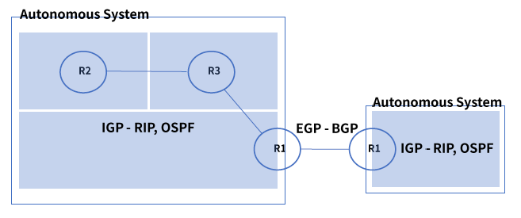

# 5. 동적 라우팅

### 라우팅 프로토콜

- 정적(Static) : 경로 정보를 라우터에 미리 저장하여 패킷 전송
- 동적(Dynamic) : 경로 정보가 네트워크 상황에 따라 더 빠른 경로로 변경되어 패킷 전송

### 라우팅 알고리즘

#### 역할

- 목적지까지의 최적 경로를 계산하고 라우팅 테이블에 업데이트

- 동적으로 라우팅 테이블을 유지 및 관리하는 알고리즘

  - Distance Vector : 

    분산 업데이트, 각 라우터들에 의해 최소 비용 경로 계산 -> 인접 노드와 교환

    소규모 네트워크, 주기적이며 비동기 방식

  - Link State: 중앙 집중형 업데이트, 네트워크 전체 정보를 통해서 최소 비용 경로 계산

    대규모 네트워크에 적합, 이벤트 기반 라우팅 테이블 관리

### 동적 라우팅 구분

- 동적 라우팅 프로토콜은 AS(Autonomous System)에 따라 구분된다.
- IGP(Interior Gateway Protocol): AS 내에서 동작하는 라우팅 프로토콜
- EGP(Exterior Gateway Protocol): AS와 AS간의 라우팅 프로토콜

#### AS(Autonomous System)

- 하나의 회사 또는 단체 안에서 동일한 정책으로 관리되는 라우터들의 집단

#### EGP(Exterior Gateway Protocol)

- BGP(Border Gateway Protocol) - 현재 쓰이는 가장 대표적인 EGP 라우팅 프로토콜
  - ISP to ISP 연결 간 사용
  - 경로 벡터 라우팅 프로토콜을 사용 - 루핑 방지
  - 변경 또는 추가 된 부분만 업데이트
  - 빠른 속도 보다는 조직 또는 단체간 맺어진 정책에 의거하여 최적 경로 결정
  - BGP 메시지 4가지 : OPEN, UPDATE, NOTIFICATION, KEEPALIVE
    - eBGP : 서로 다른 AS 간의 연결 및 라우팅 정보 교환
    - iBGP : 동일 AS 내에서 BGP 라우팅 정보 교환

#### IGP(Interior Gateway Protocol)

- RIP(Routing Information Protocol)
  - Distance Vector 기반의 IGP용 라우팅 프로토콜
  - 속도가 아닌 거리(라우터의 홉) 기반 경로 선택
  - 주기적으로 전체 라우팅 테이블 업데이트 - 30초
  - 구성이 간단, 적은 메모리 사용, 소규모 네트워크에서 주로 사용
  - RIPv1 : Classful 라우팅, 라우팅 업데이트 시 서브넷 마스크 정보를 전달하지 않음, 브로드 캐스팅
  - RIPv2 : Classless 라우팅, 라우팅 업데이트 시 서브넷 마스크 정보 전달, 멀티 캐스팅, Triggerd Update 설정 가능

#### OSPF(Open Shortest Path First)

- 링크 스테이트 라우팅 알고리즘을 사용하는 IGP용 라우팅 프로토콜
- RIPv1의 단점을 보완
  - 홉 카운트의 제한 없음
  - VLSM(Variable-Length Subnet Mask)사용하여 효율적 IP 관리
  - 변경된 정보만 전파, 적은 량의 라우팅 트래픽 유방
  - 단순 라우터의 홉이 아닌 링크의 상태로 경로 결정
  - Convergence 타임이 빠름
- 계층적 구조, 여러개의 Area로 나뉘고 각 영역은 독립적으로 라우팅 수행
  - ASBR(AS boundary Router) : 다른 AS에 있는 라우터와 라우팅 정보 교환
  - Backbone Router : AS 내의 여러 Area들을 모두 연결, OSPF 도메인 내에서 모든 링크 상태 정보를 취합하고 분배
  - ABR(Area Border Router) : 각 Area와 백본 Area 0을 연결

##### OSPF 메시지

- 인접 라우터 발견 및 관계 유지, 멀티 캐스트 사용

LSDB(Link State Database) : 각 OSPF Area 내 전체 망 정보, 링크 상태 및 경로 정보, LSA(Link State Advertisement) 패킷들에 의해 구축, LSU && DD 메시지를 통해 전달

1. Hello : 인접 라우터 및 로컬 링크 상태 검색, 관계를 설정하고 주요 매개변수 전달, 일정 간격으로 인접 라우터들의 상태 확인
2. DBD(Database Description) : OSPF 정보 구축을 위해 LSDB 내용을 전달
3. LSR(Link State Request) : 상태 라우터에게 링크 상태 정보를 요청
4. LSU(Link State Update) : 네트워크 변화 발생시 인접 라우터에게 상태 전달
5. LSAck(Link State Acknowledgment) : 수신 확인, 신뢰성 확보

##### 테이블 종류

1. OSPF 네이버 테이블
2. OSPF DB 테이블
3. 라우팅 테이블

##### 링크 종류

1. Point to Point - 라우터와 라우터가 1:1로 직접 연결
2. Transient - 여러개의 라우터가 동일한 Area에 버스를 통해서 연결
3. Stub - 하나의 Area에 1개 라우터만 연결
4. Virtual - 물리적으로 백본영역과 연결이 어려운 상태에서 가상으로 연결

##### DR & BDR

DR : Designated Router

BDR : Back-up Designated Router

=> 이 둘은 중복되는 LSA 교환을 방지하고자 선출

LSA(Link State Advertisment) - 라우팅 기초 정보가 담겨진 패킷으로 링크 상태, 인접 관계 형성, 요약 정보, 네트워크/링크의 경로 비용 포함

DR/BDR은 다른 라우터들과 LSA 정보를 교환하여 인접 네이버 관계 형성

OSPF Priority가 가장 높은 라우터가 DR로 선출(동일시 라우터 ID로 선출)

그 외 라우터들은 LSA 정보를 교환하지 않고 Hello만 교환 후 네이버 관계 형성

### 참조

fastcampus