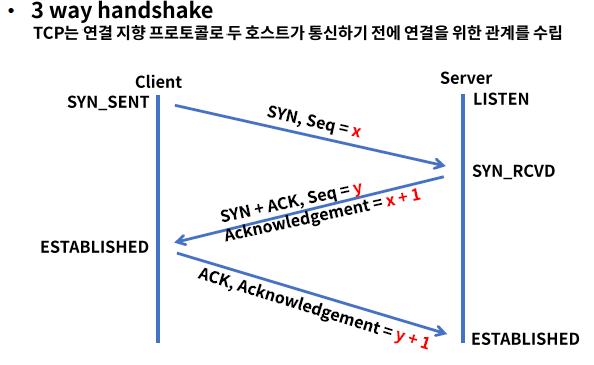
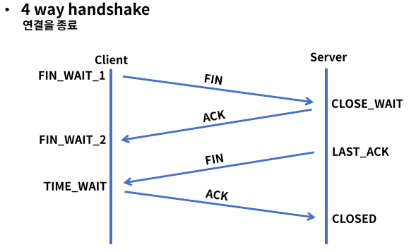
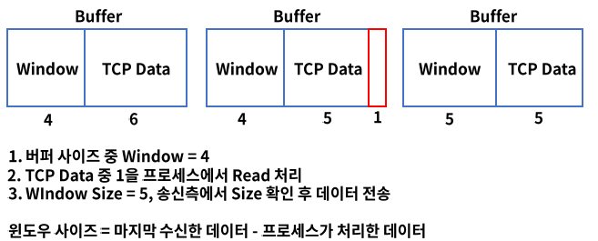

# 6. TCP와 NAT

### Transport 계층

- End to End 서비스, 커넥션(연결)을 관리
- Connection-oriented, Reliability, Flow control, Multiplexing
- TCP & UDP, 소켓을 통한 프로세스별 통신
- 5 tuple = Source IP, Source Port, Dest IP, Dest Port, Protocol

### Port

- 전송 계층에서 사용되며 특정 프로세스를 구분하는 단위
- 0~1023 : well-known port
- 1024~49151 : registed prot
- 49152 ~ 65535 : dynamic port

## TCP

- Transmission Control Protocol, 전송 제어 프로토콜
- 인터넷을 구성하는 핵심 프로토콜
- 신뢰성을 기반으로 데이터를 에러 없이 전송, 1:1 통신
- 연결 지향, 패킷의 상태 정보를 확인하고 유지
- 에러 발생시 재전송을 요청하고 에러를 복구한다.

### TCP 제어 플래그

활성화 되는 값을 비트 "1"로 표현하여 전달

1. URG : 긴급함을 알림, 긴급 데이터로 우선 순위를 높여 먼저 송신
2.  ACK : 확인, 수신측에서 송신된 패킷을 정상적으로 받았음을 알림
3. PSH : 버퍼링 되지 않고 바로 송신
4. RST : 비정상 상황에서 연결을 끊음
5. SYN : 연결을 맺기 위해 보내는 패킷
6. FIN : 정상 종료, 송신측에서 수신측에 연결 종료 요청

### TCP 통신 과정

### TCP 타이머 - Retransmission

- 송신측이 패킷을 매번 전송할 때 카운트
- RTO(Retransmission Timeout) 내 ACK 응답이 오지 않으면 재전송
- RTO는 RTT(Round Trip Time)에 따라서 가변적으로 변함
- SRTT(Smoothed Round-Trip Time), RTTVAR (Round-Trip Time Variation)
- alpha = 1/8, beta = 1/4, R = 측정된 RTT, G = clock granularity
- RTTVAR = (1 - beta) * RTTVAR + beta * |SRTT - R|
- SRTT = (1 - alpha) * SRTT + alpha * R
- RTO = SRTT + max(G, 4*RTTVAR)

### TCP 타이머 - Persistence

- 윈도우 사이즈 관련 타이머
- 수신측에서 용량 부족으로 윈도우 사이즈 없음을 보내고 다시 용량에 여유가 생기면 송신측에 요청
- 중간에서 윈도우 사이즈 >0 을 보내는 ACK이 유실되면 서로 통신 간 문제 발생
- 수신측에서 윈도우 사이즈 = 0 을 보낼 경우 Persistence 타이머 가동 - RTO
- Persistence 타이머가 종료되면 Probe(ACK 재전송 요청)를 보내고 타이머 재 가동
- 다시 타이머가 종료되기 전에 ACK을 수신 못하면 시간을 2배로 늘리고 Probe 재 전송
- 타이머의 임계치는 60초

### TCP 타이머 - Time waited

- TCP 연결 종료 후에 특정 시간만 연결을 유지
- MSL(Maximum Segment Lifetime) = 120초, TIME_WAIT = 2MSL
- 다른 연결이 맺어진 상태에서 이전 연결의 지연/중복 패킷 도착으로 인한 문제 발생

### TCP 타이머 - Keepalive

- TCP 연결 유지 타이머
- TCP 연결을 맺고 수신측에서 2시간 동안 송신하는 패킷이 없으면 수신측은 75초 단위로 Probe 전송
- Probe를 9개 보내고 응답이 없으면 연결 종료
- Probe 9개 이전에 응답이 있으면 타이머는 재 설정됨

### 흐름 제어 - Flow Control

- 송신과 수신측의 데이터 처리 속도 차이를 해결
- Sliding Window 기법, Window = 데이터 전송을 위한 버퍼

### 혼잡 제어 - Congestion Control

수신측으로 유입되는 트래픽의 양이 정해진 대역폭을 넘어가지 않도록 제어

1. AIMD(Additive Increase/Multiplicative Decrease)
   - 패킷 전송시 문제 없으면 Windows size 1씩 증가, 타임아웃 또는 loss 시 패킷 속도 1/2감소
   - 초기에 높은 대역폭 사용 불가, 미리 혼잡상태 감지 불가
2. Slow Start
   - 패킷 전송시 문제 없으면 Windows size 2배씩 증가, 혼잡 상태 발생시 1로 변경
   - 사전 혼잡 상태를 기록하고 Windows size 절반까지 2배씩 증가 후 1씩 증가
3. Fast Retrasmit - TCP Tahoe / Fast Recovery - TCP Reno
   - 수신측에서 먼저 와야 하는 패킷이 오지 않고 다음 패킷이 오게 되어도 송신측에 ACK을 보냄
   - 송신측은 타임아웃 시간을 기다리지 않고 중복된 순번의 패킷을 3번 받으면 재전송
4. 개선된 Fast Retransmit / Fast Recovery
   - TCP New, Reno, SACK(TCP Tahoe + Selective Retransmit)

## UDP

- User Datagram Protocol
- 신뢰성은 낮으나 데이터 전송이 빠르다.
- 송신측은 일반적으로 데이터를 보내고 확인하지 않는다. => 1:N 통신 가능
- Connectionless, 재전송이 불가능, 실시간 데이터 전송에 적합하다.
  - ex) 스트리밍 서비스

### 참조

fastcampus