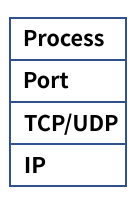
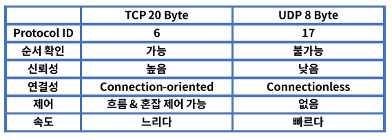

# 6. TCP와 NAT

### Transport 계층

- End to End 서비스, 커넥션(연결)을 관리
- Connection-oriented, Reliability, Flow control, Multiplexing
- TCP & UDP, 소켓을 통한 프로세스별 통신
- 5 tuple = Source IP, Source Port, Dest IP, Dest Port, Protocol

### Port

- 전송 계층에서 사용되며 특정 프로세스를 구분하는 단위
- 0~1023 : well-known port
- 1024~49151 : registed prot
- 49152 ~ 65535 : dynamic port

## TCP

- Transmission Control Protocol, 전송 제어 프로토콜
- 인터넷을 구성하는 핵심 프로토콜
- 신뢰성을 기반으로 데이터를 에러 없이 전송, 1:1 통신
- 연결 지향, 패킷의 상태 정보를 확인하고 유지
- 에러 발생시 재전송을 요청하고 에러를 복구한다.

### TCP 제어 플래그

활성화 되는 값을 비트 "1"로 표현하여 전달

1. URG : 긴급함을 알림, 긴급 데이터로 우선 순위를 높여 먼저 송신
2.  ACK : 확인, 수신측에서 송신된 패킷을 정상적으로 받았음을 알림
3. PSH : 버퍼링 되지 않고 바로 송신
4. RST : 비정상 상황에서 연결을 끊음
5. SYN : 연결을 맺기 위해 보내는 패킷
6. FIN : 정상 종료, 송신측에서 수신측에 연결 종료 요청

## UDP

- User Datagram Protocol
- 신뢰성은 낮으나 데이터 전송이 빠르다.
- 송신측은 일반적으로 데이터를 보내고 확인하지 않는다. => 1:N 통신 가능
- Connectionless, 재전송이 불가능, 실시간 데이터 전송에 적합하다.
  - ex) 스트리밍 서비스

