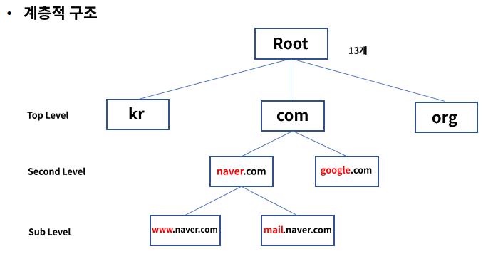
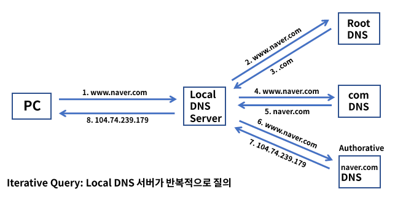

# 7. Application Service

### Application 계층

- TCP/IP 모델에서 최상위 계층으로 사용자와 가장 가까운 소프트웨어
- 여러 프로토콜 개체들의 서비스에 대한 사용자 인터페이스 제공
- HTTP, DNS, SMTP, SSH, BGP, DHCP 등이 이 범주에 속한다.

## DNS의 이해

### DNS(Domain Name Service)

- 호스트(도메인) 이름을 IP 주소로 변환 - Port 53
- 웹 사이트 접속 또는 이메일 전송 시 도메인 이름으로 접속 ex) .google.com
- 사람이 좀 더 기억하기 쉬운 문자 형태의 도메인 개발

- 계층적 구조로 이루어져 있다.
  - 
- 쿼리 과정은 Recursive Query를 통해 Local DNS 서버가 재귀적으로 여러 서버에게 질의하여 응답은 받는다.
  - 
  - 

- Resource Records: DNS 레코드, DNS 서버가 가지고 있는 IP 매핑 정보 테이블
- DNS 메시지는 쿼리와 응답으로 구분된다.
  - Query: Header + Question
  - Response: Header + Question + Answer + Authority + Additional
- Hosts.txt: 호스트 이름과 IP 주소가 매핍되어 저장된 파일로 Local DNS로 쿼리 전에 우선 참조하는 파일이다.
- DNS 캐시 테이블: 기존에 응답 받은 DNS 정보를 일정시간(TTL) 저장하고 동일한 질의 시 응답한다.

## HTTP의 이해

### HTTP(HyperText Transfer Protocol)

- WWW 상에서 정보를 공유하는 프로토콜 - Port 80 - HTML
- WWW(World Wide Web) - 전 세계에 연결된 인터넷을 통해 정보를 공유
- HTML(HyperText Markup Language) - 웹 페이지 언어
- URL(Unifrom Resource Locator)
- 

#### HTTP Request

- Client가 Server에게 특정 Method를 사용하여 요청
- Head, Body로 구성
- HTTP Method/ Request target/ HTTP version
  - HTTP Method: 요청의 목적 - GET, POST, PUT, HEAD, DELETE
    - GET: 리소스 요청
    - POST: 내용 전송
    - PUT: 내용 갱신
    - HEAD: 리소스에 대한 정보만 요청
      - Accept: 클라이언트가 허용 가능한 파일 형식
      - User-Agent: 클라이언트의 OS, 브라우저 정보
      - Host: 서버의 도메인 네임
    - DELETE: 리소스 제거
  - Request target: 리소스 경로
  - HTTP version: HTTP1.1 or HTTP/2

#### HTTP Response

- Client 요청에 따른 Server의 응답
- Head + Body
- Version / Status/ Status Message
  - Version: HTTP 버전
  - Status: 상태
  - Status Message: 상태 메세지
  - Status code
    - 2**: Success
    - 3**: Redirection
    - 4**: Client Error
    - 5**: Server Error

