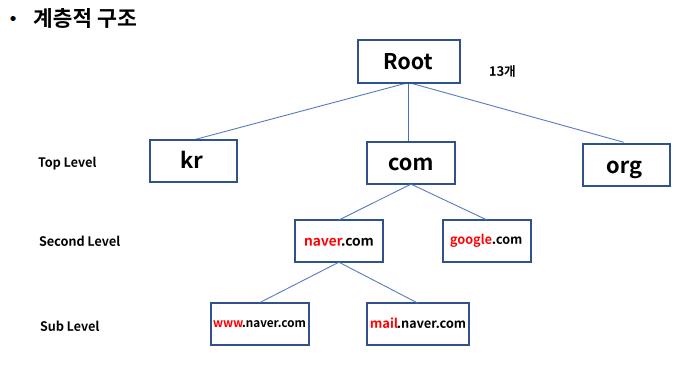
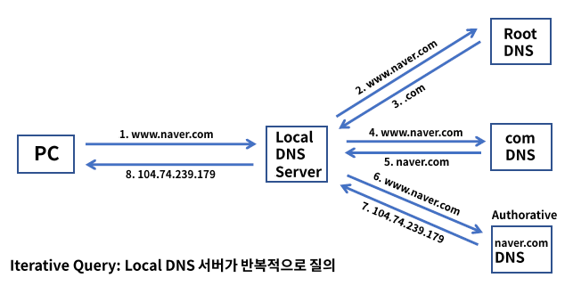
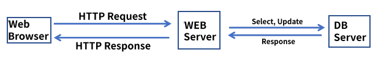
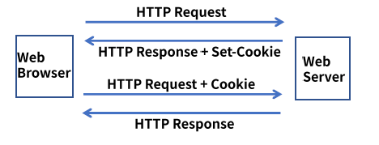
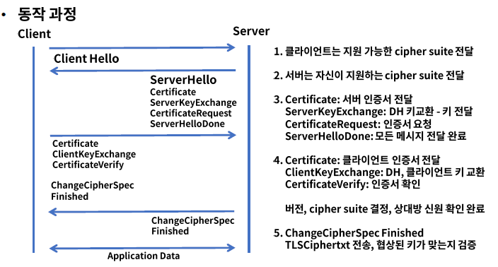
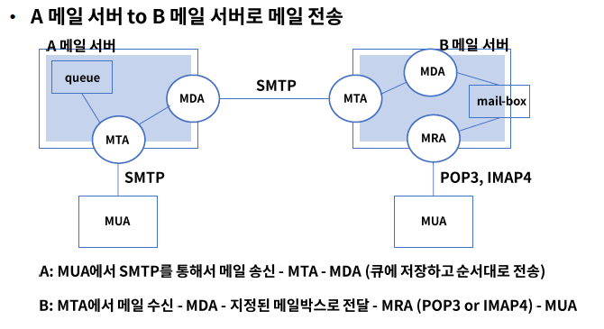

# 7. Application Service

### Application 계층

- TCP/IP 모델에서 최상위 계층으로 사용자와 가장 가까운 소프트웨어
- 여러 프로토콜 개체들의 서비스에 대한 사용자 인터페이스 제공
- HTTP, DNS, SMTP, SSH, BGP, DHCP 등이 이 범주에 속한다.

## DNS의 이해

### DNS(Domain Name Service)

- 호스트(도메인) 이름을 IP 주소로 변환 - Port 53
- 웹 사이트 접속 또는 이메일 전송 시 도메인 이름으로 접속 ex) .google.com
- 사람이 좀 더 기억하기 쉬운 문자 형태의 도메인 개발

- 계층적 구조로 이루어져 있다.
  - 
- 쿼리 과정은 Recursive Query를 통해 Local DNS 서버가 재귀적으로 여러 서버에게 질의하여 응답은 받는다.
  - 
  - 

- Resource Records: DNS 레코드, DNS 서버가 가지고 있는 IP 매핑 정보 테이블
- DNS 메시지는 쿼리와 응답으로 구분된다.
  - Query: Header + Question
  - Response: Header + Question + Answer + Authority + Additional
- Hosts.txt: 호스트 이름과 IP 주소가 매핍되어 저장된 파일로 Local DNS로 쿼리 전에 우선 참조하는 파일이다.
- DNS 캐시 테이블: 기존에 응답 받은 DNS 정보를 일정시간(TTL) 저장하고 동일한 질의 시 응답한다.

## HTTP의 이해

### HTTP(HyperText Transfer Protocol)

- WWW 상에서 정보를 공유하는 프로토콜 - Port 80 - HTML
- WWW(World Wide Web) - 전 세계에 연결된 인터넷을 통해 정보를 공유
- HTML(HyperText Markup Language) - 웹 페이지 언어
- URL(Unifrom Resource Locator)
- 

#### HTTP Request

- Client가 Server에게 특정 Method를 사용하여 요청
- Head, Body로 구성
- HTTP Method/ Request target/ HTTP version
  - HTTP Method: 요청의 목적 - GET, POST, PUT, HEAD, DELETE
    - GET: 리소스 요청
    - POST: 내용 전송
    - PUT: 내용 갱신
    - HEAD: 리소스에 대한 정보만 요청
      - Accept: 클라이언트가 허용 가능한 파일 형식
      - User-Agent: 클라이언트의 OS, 브라우저 정보
      - Host: 서버의 도메인 네임
    - DELETE: 리소스 제거
  - Request target: 리소스 경로
  - HTTP version: HTTP1.1 or HTTP/2

#### HTTP Response

- Client 요청에 따른 Server의 응답
- Head + Body
- Version / Status/ Status Message
  - Version: HTTP 버전
  - Status: 상태
  - Status Message: 상태 메세지
  - Status code
    - 2**: Success
    - 3**: Redirection
    - 4**: Client Error
    - 5**: Server Error

#### HTTP 속성 - Stateless

- HTTP는 통신이 끝나면 상태 정보를 유지하지 않는다.
- 서버는 HTTP 요청에 대한 응답을 보내고 접속을 끊어 커넥션 리소스 비용을 줄인다.
- 단순 페이지 또는 문서 정보 열람은 가능 but 클라이언트가 새로운 페이지를 접속할 때마다 서버는 신원을 확인할 수 없다.
  - ex) 회원 정보 식별, 로그인 여부, 결제 정보 및 장바구니 등등

=> 해결책으로 Cookie & Session이 등장했다.

#### HTTP Cookie

- 클라이언트 웹 브라우저 로컬에 저장되는 키와 값이 들어 있는 파일이다.
- 이름, 값, 도메인, 만료일, 경로 등을 일정 시간동안 저장한다.

##### Session

- 서버는 일정 시간 웹브라우저의 요청이 들어오면 하나의 상태로 유지
- 서버는 클라이언트에 대한 세션 ID 발급 및 보유 -> 쿠키로 전달 -> 동일 세션 ID로 접속 -> 정보 확인
- 쿠키는 사용자 로컬에 정보가 저장 -> 유출 또는 조작이 가능하지만 Session은 서버에 정보를 저장한다.(쿠키에비해 상대적으로 안전하다.)

- 인증에 세션을 사용하는 것이 안전을 보장하지는 않음 <- 세션 하이재킹 등등 => HTTPS - SSL/TLS 등이 등장

#### SSL/TLS

- SSL(Secure Socket Layer) / TLS(Transport Layer Security)
- TCP/IP 네트워크 통신간 보안을 제공하는 프로토콜

##### 기능

- 인증 - Client to Server 통신 간 상대방에 대한 인증 - RSA, DSS
- 무결성 - 메시지 인증 코드로 제공 HMAC - MD5, SHA-2
- 기밀성 - 데이터 암호 - 3DES, RC4

##### 프로토콜 구성

- 상위
  - HandShake: 키 교환 방식, 암호화 방식, HMAC 방식, 압축 방식 등을 협상
  - Change Cipher Spec: 협상 정보가 적용됨을 알림
  - Alert: 협상 과정에서 제시한 암호화 방식을 지원 못하는 경우 알림
- 하위
  - Record: 데이터 교환, 메시지를 전송

## 메일 서비스

### Email

- Electronic mail: 전자 메일
- 업무 용도로 널리 쓰임
- SMTP(Simple Mail Transfer Protocol): 전자 메일 전송을 위한 표준 프로토콜 =>메일 발신
- POP3(Post Office Protocol Version3): 수신 서버의 메일 박스에서 메일을 가져오고 삭제하는 프로토콜 => 서버에서 메일을 가져오고 서버에서 삭제
  - 아웃룩 같은 메일 클라이언트 프로그램에서 사용된다.
- IMAP4(Internet Message Access Protocol4): 메일 서버로 접속하여 메일을 읽거나 삭제하는 프로토콜 => 중앙 서버에서 메일을 관리 ,접속하여 확인
  - 원하는 메일 메세지만 전송, 다중 접속 가능, 메일 보관함 연동 등을 통해 메일 서버의 자원 사용률이 높아진다.

##### 동작 과정

- 메일 서버: MTA(Mail Transfer Agent): 메일 전송
- 메일 클라이언트: MTU(Mail User Agent): 메일 송수신 프로그램
- MDA(Mail Delivery Agent): MTA가 수신한 메일을 수신자 우편함에 기록
- MRA(Mail Retrieval Agent): 리모트 서버의 우편함에서 사용자에게 메일을 가져오는 프로그램

